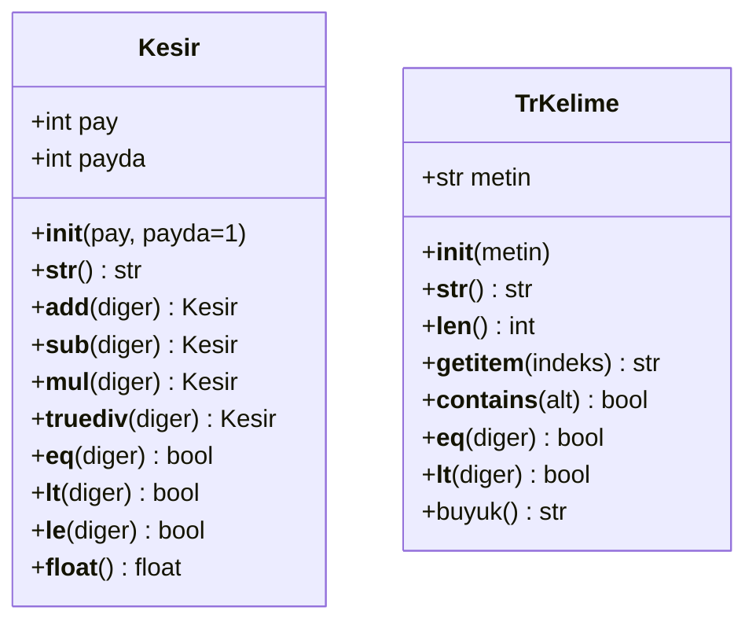

# Hafta 8 - UML Sınıf Diyagramları
Halil İbrahim Arslan - 20253004034

```mermaid
classDiagram
    class Kesir {
        +int pay
        +int payda
        +__init__(pay, payda=1)
        +__str__() str
        +__add__(diger) Kesir
        +__sub__(diger) Kesir
        +__mul__(diger) Kesir
        +__truediv__(diger) Kesir
        +__eq__(diger) bool
        +__lt__(diger) bool
        +__le__(diger) bool
        +__float__() float
    }

    class TrKelime {
        +str metin
        +__init__(metin)
        +__str__() str
        +__len__() int
        +__getitem__(indeks) str
        +__contains__(alt) bool
        +__eq__(diger) bool
        +__lt__(diger) bool
        +buyuk() str
    }
```
